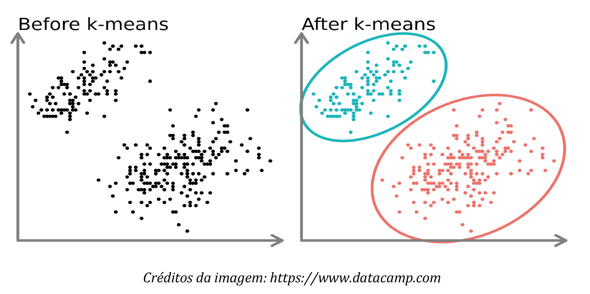

# 🧠 K-Means-Algorithm-RISC-V

## 📝 Project Overview

The goal of this project is to develop a program in RISC-V assembly that, given an initial set of points in a two-dimensional (2D) space, identifies k groups of points based on the relative proximity of points within each group. This is achieved by implementing the iterative k-means algorithm.

This algorithm is widely used in applications across different domains – from computer vision, machine learning, intrusion detection in cybersecurity, to astronomy. For these applications to be effective, it is essential that the k-means algorithm implementation is efficient.

A good description of the algorithm can be found [here](https://statquest.org/statquest-k-means-clustering/).

## 📥 Input Parameters

The final program receives the following main inputs:

- **points**: a vector of points in 2D space (each point consists of a pair of coordinates, {x,y})
- **n**: the number of points, i.e., the dimension of the points vector
- **k**: the number of clusters to consider, i.e., the k parameter of the k-means algorithm
- **l**: the maximum number of algorithm iterations

From these elements, the k-means algorithm is executed once. The optimization of running multiple algorithm instances and choosing the one that minimizes variance is outside the scope of this project.

## 🚀 How to Run

During the development of this project, the application used was Ripes, a graphical RISC-V simulator. You can download it from the [Ripes GitHub Releases page](https://github.com/mortbopet/Ripes/releases) or use the web version at [Ripes Web](https://ripes.me/).

### ✅ 1. Install Ripes or use the Web Version

Go to the Ripes GitHub Releases page and download the appropriate version for your system.

Once downloaded, install (or extract) and open the Ripes application.

### ✅ 2. Open the Program

In the Ripes interface:

1. Click on **File → Load Program**.

2. Select the `kmeans_final.s` file provided in this repository.

### ✅ 3. Set Up the Environment

Before running the program, open the LED Matrix in the **I/O** tab:

- Set width and height to 32

- Adjust the LED size to your preference (e.g., 20).

- Double-click the LED matrix border to display the matrix.

### ✅ 4. Run the Program

- Go back to the **Editor** tab.

- Press **Run** to start execution.

- Follow the printed console messages to monitor each iteration of the k-means algorithm and understand the clustering process.

### ✅ 5. Explore more

Feel free to experiment:

- Modify input parameters (number of points, coordinates, initial centroids, number of clusters, etc.).

- Check the **Memory** tab to view how clusters and centroids are stored.

- Explore step-by-step execution, pipeline behavior, and more through other Ripes tools.

## 📄 Project Description

You can find the full project description [here](https://github.com/maddie0120/kmeans-algorithm-riscv/blob/main/enunciado-projeto-IAC2024.pdf).
